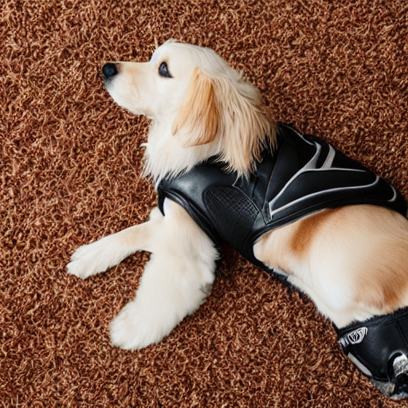
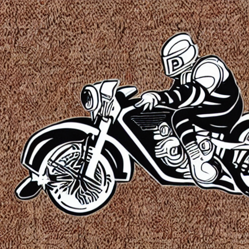
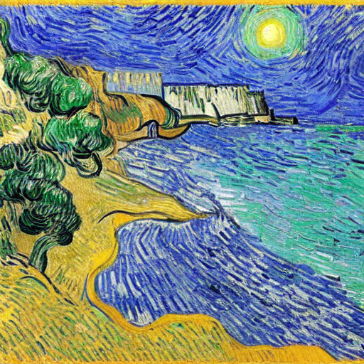
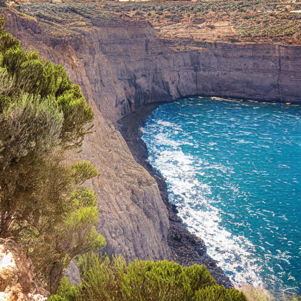

# Multi-Layer Activation Steering for Image Generation

**Advanced Machine Learning course project | Sapienza University of Rome**  
**Control Stable Diffusion at inference time.** Remove objects, erase styles, or suppress unsafe content without retraining.

---

### ✨ See it in action

By identifying and shifting specific activation vectors within the U-Net, we can effectively "erase" concepts from the generation process while preserving the overall composition.

<table>
  <tr>
    <td align="center">
      <br />
      <sub>Original</sub>
    </td>
    <td align="center">
      <br />
      <sub>Steered</sub>
    </td>
  </tr>
</table>

---

### Overview

This project investigates **Activation Steering** for text-to-image models (specifically **Stable Diffusion 1.5**). Unlike fine-tuning, which requires expensive training, activation steering modifies the internal model states on the fly to suppress unwanted concepts or enforce safety constraints.  
**Key points:**

* **Inference-only control**: No retraining/fine-tuning; works with standard pre-trained checkpoints.  
* **Multi-Layer intervention**: Applies steering vectors across multiple U-Net layers and diffusion timesteps for robust erasure.  
* **Concept suppression**: effectively removes:  
  * **Objects** (e.g., Dogs )

  * **Artistic styles** (e.g., Van Gogh )

  * **Unsafe content** (e.g., Violence, Nudity )

<table>
  <tr>
    <td align="center">
      <br />
      <sub>Original</sub>
    </td>
    <td align="center">
      <br />
      <sub>Steered</sub>
    </td>
  </tr>
</table>

---

### 🧠 Methodology: adapting Layer Navigator

A critical challenge in steering diffusion models is knowing *where* to intervene among hundreds of U-Net layers.  
To solve this, we adapted the **Layer Navigator** framework, originally proposed by **Sun et al.** for Large Language Models.

#### **From LLMs to computer vision**

While Sun et al. designed these metrics for text, we transposed them to the visual domain to score U-Net layers based on:

1. **Discriminability**: How well the layer's activations distinguish between the target concept (e.g., "Violence") and a neutral baseline.

2. **Consistency**: How stable the steering direction is across different prompts.

<table>
  <tr>
    <td align="center">
      <br />
      <sub>Original</sub>
    </td>
    <td align="center">
      <br />
      <sub>Steered</sub>
    </td>
  </tr>
</table>

---

### **💻 Quick Start**

**1\. Installation**

```bash
git clone https://github.com/d-marretta/MultiLayerActivationSteering.git
cd MultiLayerActivationSteering
pip install -r requirements.txt
```

**2\. Demo**

To see the steering in action, run the demo.ipynb notebook. It walks through:

* Loading the Stable Diffusion 1.5 pipeline.
* Extracting activations from a target dataset (e.g., data/extraction/dogs.csv).
* Computing the steering vector.
* Generating images with and without steering.

---

### **📂 Repository structure**

* ```data/```: Contrastive prompt datasets (Positive vs. Negative) for extraction and evaluation.  
* ```notebooks/```: Interactive demos and metric evaluation (FID, CLIP, NudeNet).  
* ```src/```: Core implementation of the steering hooks and Layer Navigator analysis.  

---

### **Authors**

* **Davide Perniconi**  
* **Olja Corovencova**  
* **Daniele Marretta**  
* **Leonardo Lavezzari**

### **📚 References**

**[1]** R. Rombach, A. Blattmann, D. Lorenz, P. Esser, and B. Ommer, “High-resolution image synthesis with latent diffusion models,” in *Proceedings of the IEEE/CVF Conference on Computer Vision and Pattern Recognition (CVPR)*, Jun. 2022, pp. 10 684–10 695.

**[2]** H. Sun, H. Peng, Q. Dai, X. Bai, and Y. Cao, “Layer-navigator: Finding promising intervention layers for efficient activation steering in large language models,”

**[3]** A. Arditi et al., “Refusal in language models is mediated by a single direction,” *Advances in Neural Information Processing Systems*, vol. 37, pp. 136 037–136 083, 2024.

**[4]** S. Facchiano et al., “Video unlearning via low-rank refusal vector,” *arXiv preprint arXiv:2506.07891*, 2025.

**[5]** R. Rombach, A. Blattmann, D. Lorenz, P. Esser, and B. Ommer, “High-resolution image synthesis with latent diffusion models,” in *Proceedings of the IEEE/CVF Conference on Computer Vision and Pattern Recognition (CVPR)*, Jun. 2022, pp. 10 684–10 695.

**[6]** A. Abid, M. J. Zhang, V. K. Bagaria, and J. Zou, “Contrastive principal component analysis,” *arXiv preprint arXiv:1709.06716*, 2017.

**[7]** A. Mukherjee, *Coco dog images with captions*, [HuggingFace Dataset](https://huggingface.co/datasets/ArkaMukherjee/coco_dog_images_with_captions), 2023.

**[8]** C. Zhang, T. Zhang, L. Wang, R. Chen, W. Li, and A. Liu, “T2i-riskyprompt: A benchmark for safety evaluation, attack, and defense on text-to-image model,” *arXiv preprint arXiv:2510.22300*, 2025.

**[9]** G. Su, S.-Y. Wang, A. Hertzmann, E. Shechtman, J.-Y. Zhu, and R. Zhang, “Identifying prompted artist names from generated images,” *arXiv preprint arXiv:2507.18633*, 2025.

**[10]** A. Radford et al., “Learning transferable visual models from natural language supervision,” in *International conference on machine learning*, PmLR, 2021, pp. 8748–8763.

**[11]** notAI.tech, *Nudenet*, [GitHub Repository](https://github.com/notAI-tech/nudenet), 2020.
